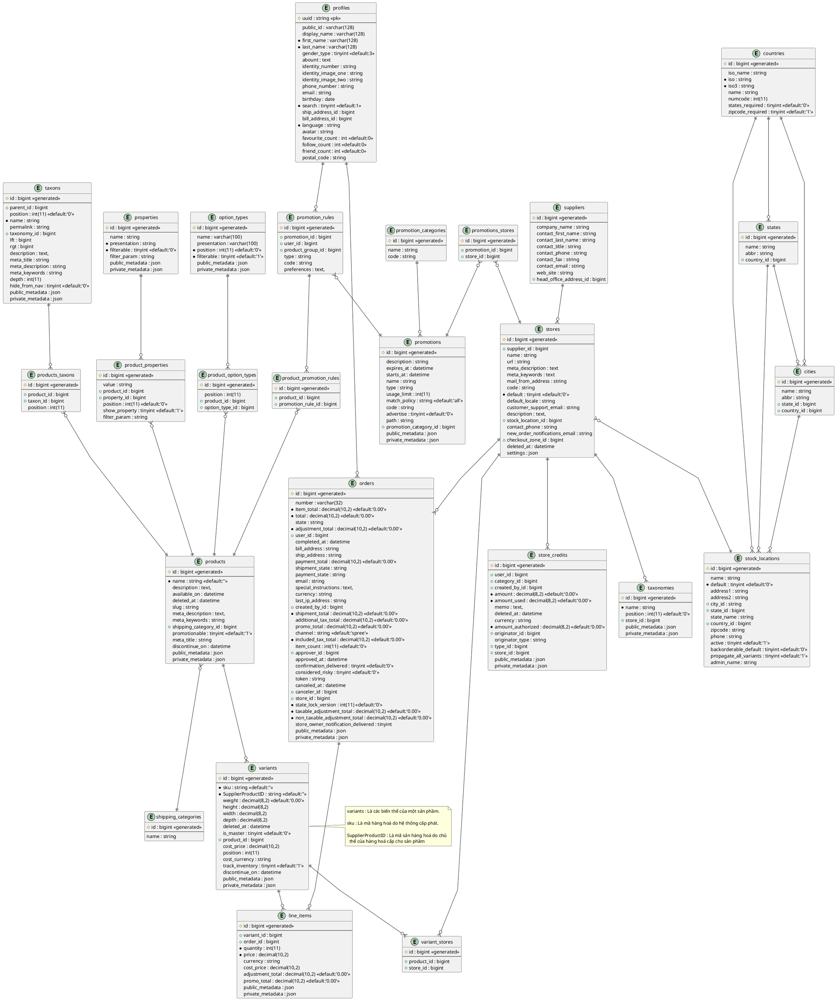

```plantuml
@startuml
skinparam linetype polyline

entity "countries" {
    #id : bigint <<generated>>
    --
    iso_name : string
    *iso : string
    *iso3 : string
    name : string
    numcode : int(11)
    states_required : tinyint <<default:'0'>>
    zipcode_required : tinyint <<default:'1'>>
}

entity "states" {
    #id : bigint <<generated>>
    --
    name : string
    abbr : string
    +country_id : bigint
}

entity "cities" {
    #id : bigint <<generated>>
    --
    name : string
    abbr : string
    +state_id : bigint
    +country_id : bigint
}

entity "profiles" {
    #uuid : string <<pk>>
    --
    public_id : varchar(128)
    display_name : varchar(128)
    *first_name : varchar(128)           
    *last_name : varchar(128)
    gender_type : tinyint <<default:3>>
    abount : text
    identity_number : string
    identity_image_one : string
    identity_image_two : string
    phone_number : string
    email : string
    birthday : date
    *search : tinyint <<default:1>>
    ship_address_id : bigint
    bill_address_id : bigint
    *language : string
    avatar : string
    favourite_count : int <<default:0>>
    follow_count : int <<default:0>>
    friend_count : int <<default:0>>
    postal_code : string
}

entity "stores" {
    #id : bigint <<generated>>
    --
    +supplier_id : bigint
    name : string
    url : string
    meta_description : text
    meta_keywords : text
    mail_from_address : string
    code : string
    *default : tinyint <<default:'0'>>
    default_locale : string
    customer_support_email : string
    description : text,
    +stock_location_id : bigint
    contact_phone : string
    new_order_notifications_email : string
    +checkout_zone_id : bigint
    deleted_at : datetime
    settings : json
}

entity "suppliers" {
    #id : bigint <<generated>>
    --
    company_name : string
    contact_first_name : string
    contact_last_name : string
    contact_title : string
    contact_phone : string
    contact_fax : string
    contact_email : string
    web_site : string
    +head_office_address_id : bigint
}

entity "orders" {
    #id : bigint <<generated>>
    --
    number : varchar(32)
    *item_total : decimal(10,2) <<default:'0.00'>>
    *total : decimal(10,2) <<default:'0.00'>>
    state : string
    *adjustment_total : decimal(10,2) <<default:'0.00'>>
    +user_id : bigint
    completed_at : datetime
    bill_address : string
    ship_address : string
    payment_total : decimal(10,2) <<default:'0.00'>>
    shipment_state : string
    payment_state : string
    email : string
    special_instructions : text,
    currency : string
    last_ip_address : string
    +created_by_id : bigint
    *shipment_total : decimal(10,2) <<default:'0.00'>>
    additional_tax_total : decimal(10,2) <<default:'0.00'>>
    promo_total : decimal(10,2) <<default:'0.00'>>
    channel : string <<default:'spree'>>
    *included_tax_total : decimal(10,2) <<default:'0.00'>>
    item_count : int(11) <<default:'0'>>
    +approver_id : bigint
    approved_at : datetime
    confirmation_delivered : tinyint <<default:'0'>>
    considered_risky : tinyint <<default:'0'>>
    token : string
    canceled_at : datetime
    +canceler_id : bigint
    +store_id : bigint
    *state_lock_version : int(11) <<default:'0'>>
    *taxable_adjustment_total : decimal(10,2) <<default:'0.00'>>
    *non_taxable_adjustment_total : decimal(10,2) <<default:'0.00'>>
    store_owner_notification_delivered : tinyint
    public_metadata : json
    private_metadata : json
}

entity "shipping_categories" {
    #id : bigint <<generated>>
    --
    name : string
}

entity "products" {
    #id : bigint <<generated>>
    --
    *name : string <<default:''>>
    description : text,
    available_on : datetime
    deleted_at : datetime
    slug : string
    meta_description : text,
    meta_keywords : string
    +shipping_category_id : bigint
    promotionable : tinyint <<default:'1'>>
    meta_title : string
    discontinue_on : datetime
    public_metadata : json
    private_metadata : json
}

entity "properties" {
    #id : bigint <<generated>>
    --
    name : string
    *presentation : string
    *filterable : tinyint <<default:'0'>>
    filter_param : string
    public_metadata : json
    private_metadata : json
}

entity "product_properties" {
    #id : bigint <<generated>>
    --
    value : string
    +product_id : bigint
    +property_id : bigint
    position : int(11) <<default:'0'>>
    show_property : tinyint <<default:'1'>>
    filter_param : string
}

entity "option_types" {
    #id : bigint <<generated>>
    --
    name : varchar(100)
    presentation : varchar(100)
    *position : int(11) <<default:'0'>>
    *filterable : tinyint <<default:'1'>>
    public_metadata : json
    private_metadata : json
}

entity "product_option_types" {
    #id : bigint <<generated>>
    --
    position : int(11)
    +product_id : bigint
    +option_type_id : bigint
}

entity "taxons" {
    #id : bigint <<generated>>
    --
    +parent_id : bigint
    position : int(11) <<default:'0'>>
    *name : string
    permalink : string
    +taxonomy_id : bigint
    lft : bigint
    rgt : bigint
    description : text,
    meta_title : string
    meta_description : string
    meta_keywords : string
    depth : int(11)
    hide_from_nav : tinyint <<default:'0'>>
    public_metadata : json
    private_metadata : json
}

entity "products_taxons" {
    #id : bigint <<generated>>
    --
    +product_id : bigint
    +taxon_id : bigint
    position : int(11)
}

entity "promotion_categories" {
    #id : bigint <<generated>>
    --
    name : string
    code : string
}

entity "promotions" {
    #id : bigint <<generated>>
    --
    description : string
    expires_at : datetime
    starts_at : datetime
    name : string
    type : string
    usage_limit : int(11)
    match_policy : string <<default:'all'>>
    code : string
    advertise : tinyint <<default:'0'>>
    path : string
    +promotion_category_id : bigint
    public_metadata : json
    private_metadata : json
}

entity "promotion_rules" {
    #id : bigint <<generated>>
    --
    +promotion_id : bigint
    +user_id : bigint
    +product_group_id : bigint
    type : string
    code : string
    preferences : text,
}

entity "product_promotion_rules" {
    #id : bigint <<generated>>
    --
    +product_id : bigint
    +promotion_rule_id : bigint
}

entity "variant_stores" {
    #id : bigint <<generated>>
    --
    +product_id : bigint
    +store_id : bigint
}

entity "variants" {
    #id : bigint <<generated>>
    --
    *sku : string <<default:''>>
    *SupplierProductID : string <<default:''>>
    weight : decimal(8,2) <<default:'0.00'>>
    height : decimal(8,2)
    width : decimal(8,2)
    depth : decimal(8,2)
    deleted_at : datetime
    is_master : tinyint <<default:'0'>>
    +product_id : bigint
    cost_price : decimal(10,2)
    position : int(11)
    cost_currency : string
    track_inventory : tinyint <<default:'1'>>
    discontinue_on : datetime
    public_metadata : json
    private_metadata : json
}

note right of variants
  variants : Là các biến thể của một sản phầm.

  sku : Là mã hàng hoá do hệ thống cấp phát.

  SupplierProductID : Là mã sản hàng hoá do chủ
    thể của hàng hoá cấp cho sản phầm
endnote

entity "line_items" {
    #id : bigint <<generated>>
    --
    +variant_id : bigint
    +order_id : bigint
    *quantity : int(11)
    *price : decimal(10,2)
    currency : string
    cost_price : decimal(10,2)
    adjustment_total : decimal(10,2) <<default:'0.00'>>
    promo_total : decimal(10,2) <<default:'0.00'>>
    public_metadata : json
    private_metadata : json
}

entity "stock_locations" {
    #id : bigint <<generated>>
    --
    name : string
    *default : tinyint <<default:'0'>>
    address1 : string
    address2 : string
    +city_id : string
    +state_id : bigint
    state_name : string
    +country_id : bigint
    zipcode : string
    phone : string
    active : tinyint <<default:'1'>>
    backorderable_default : tinyint <<default:'0'>>
    propagate_all_variants : tinyint <<default:'1'>>
    admin_name : string
}

entity "promotions_stores" {
    #id : bigint <<generated>>
    --
    +promotion_id : bigint
    +store_id : bigint
}

entity "store_credits" {
    #id : bigint <<generated>>
    --
    +user_id : bigint
    +category_id : bigint
    +created_by_id : bigint
    *amount : decimal(8,2) <<default:'0.00'>>
    *amount_used : decimal(8,2) <<default:'0.00'>>
    memo : text,
    deleted_at : datetime
    currency : string
    *amount_authorized : decimal(8,2) <<default:'0.00'>>
    +originator_id : bigint
    originator_type : string
    +type_id : bigint
    +store_id : bigint
    public_metadata : json
    private_metadata : json
}

entity "taxonomies" {
    #id : bigint <<generated>>
    --
    *name : string
    position : int(11) <<default:'0'>>
    +store_id : bigint
    public_metadata : json
    private_metadata : json
}

variants ||-d-o{ variant_stores
products ||-d-o{ variants
products }o-d-|| shipping_categories

product_promotion_rules }o-d-|| products
products_taxons }o-d-|| products
product_option_types }o-d-|| products
product_properties }o-d-|| products
properties ||-d-o{ product_properties

promotion_categories ||-d-o{ promotions

promotion_rules }o-d-|| promotions
promotion_rules ||-d-o{ product_promotion_rules

option_types ||-d-o{ product_option_types
taxons ||-d-o{ products_taxons

stores ||-d-o{ variant_stores
stores ||-d-o{ taxonomies
stores ||-d-o{ store_credits
stores ||-d-o{ orders
stores }o-d-|| stock_locations

promotions_stores }o-d-|| promotions
promotions_stores }o-d-|| stores

countries ||-d-o{ stock_locations
countries ||-d-o{ states
countries ||-d-o{ cities

states ||-d-o{ cities

cities ||-d-o{ stock_locations
states ||-d-o{ stock_locations

orders ||-d-o{ line_items

variants ||-d-o{ line_items

profiles ||-d-o{ promotion_rules
profiles ||-d-o{ orders

suppliers ||-d-o{ stores
@enduml
```